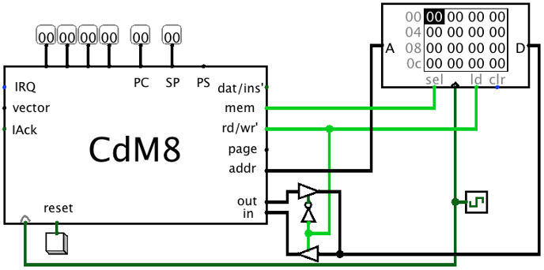
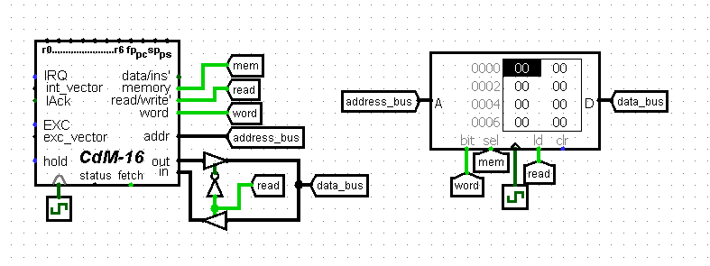

# Getting started with **`cdm-devkit`**

Some tips to start developing for CdM processors with `cdm-devkit`

## Installation

+ [Install](../README.md#installation) **`cdm-devkit`**
+ Make sure you have `cocas` available in your terminal,
  otherwise add your `(PYTHON_DIR)/Scripts` to `PATH` 

  (`PYTHON_DIR` is your Python istallation folder)
 
## Writing a program

You can write your assembly programs in `VS Code`:

+ Create a folder and open it with `VS Code`
+ Create a file with `.asm` extension
+ Write your program 
+ Assemble your program with `cocas`
    
    `cocas -t <target> <file>`
    
    `<target>` - processor name (list available names with `cocas -T`)

    `<file>` - file to be assembled

+ You get an output file with `.img` extension that you can upload to `Logisim`

## Code templates

### CdM-8/8e

```python
asect 0
# Your program starts from 0x00 address

start:
    # your code here

end.
```

### CdM-16
```python
asect 0
main: ext               # Declare labels
default_handler: ext    # as external

# Interrupt vector table (IVT)
# Place a vector to program start and
# map all internal exceptions to default_handler
dc main, 0              # Startup/Reset vector
dc default_handler, 0   # Unaligned SP
dc default_handler, 0   # Unaligned PC
dc default_handler, 0   # Invalid instruction
dc default_handler, 0   # Double fault
align 0x80              # Reserve space for the rest 
                        # of IVT

# Exception handlers section
rsect exc_handlers

# This handler halts processor
default_handler>
    halt

# Main program section
rsect main

main>
    # your code here

end.
```

## Getting started with Logisim

`Logisim` is a program that is used to simulate logical schemes.

> You can download it [here](http://www.cburch.com/logisim/download.html.)

+ Open `Logisim`
+ Load desired processor
    + `Project > Load Library > Logisim Library`
    + Select desired `.circ` processor scheme (you can find one in `cdm-devkit-misc` archive)
    + Now you have new category with a processor name in Logisim's left menu
    + Get processor from this category and put it on your canvas
+ Build your scheme
+ Load assembled program (`.img` file) to your program memory
    + Right-click on memory chip and select `Load Image`
    + Select `.img` file (one that you got from `cocas`)

    <br>

    > In Harvard architecture, where you have separate memory chips for `ROM` and `RAM`, you need to load image to `ROM` chip
+ Run the simulation with `Simulate` menu
    
    Useful keyboard shortcuts:
    + <kbd>Ctrl</kbd> + <kbd>K</kbd> - toggle clock
    + <kbd>Ctrl</kbd> + <kbd>R</kbd> - reset simulation
    + <kbd>Ctrl</kbd> + <kbd>E</kbd> - toggle simulation

## Scheme templates

### CdM-8/8e

> Processor symbols may differ, but inputs and outputs are the same

**CdM-8/8e in Von Neumann configuration:**
    


<br>

**CdM-8/8e in Harvard configuration:**


> Here `instr memory` aka instruction memory is `ROM` and `data memory` is `RAM`

### CdM-16

**With CdM-16 you should use special memory chips:**

+ In `Logisim` go to `Project > Load Library > JAR Library` 

+ Select `logisim-banked-memory-*.*.*.jar` that is located in `cdm-devkit-misc` archive in `jar` folder

+ Now you have new category in Logisim's left menu that is called `BankedROM&RAM`

+ You should use `ROM` and `RAM` from this category

> These chips emulate real banked memory configurations and allow processor to read and write 2 bytes per bus cycle

**CdM-16 in Von Neumann configuration:**



> Memory chip is `RAM` from `logisim-banked-memory`

**Harvard configuration is build the same way as with CdM-8/8e, but with memory from `logisim-banked-memory`. In this case `word` should be connected to both `RAM` and `ROM`**