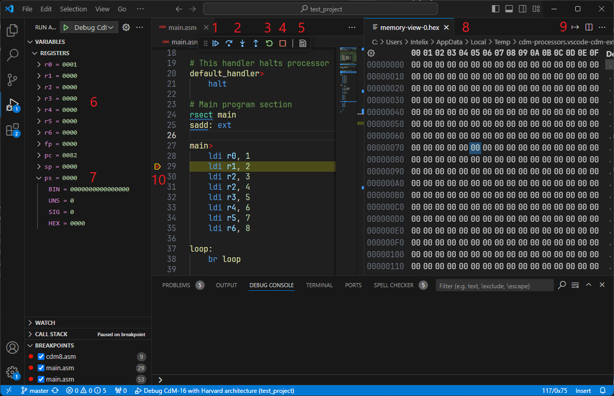

# Debugging

After you create build and launch configurations, you can run and debug your program.

Firstly, **place a breakpoint** somewhere in your program. It is important as program will start execution immediately after starting debug session.

> [!TIP]
> Breakpoints may be placed and deleted even while program is running.

In `Run and Debug` (<kbd>Ctrl</kbd>+<kbd>Shift</kbd>+<kbd>D</kbd>) select appropriate configuration and press `Play` button. Alternately, press <kbd>F5</kbd>.

Upon starting, program should stop executing on first breakpoint or exception.

Interface overview:
1. `Continue` (<kbd>F5</kbd>): resume execution of program. When program is running replaced by `Pause` (<kbd>F6</kbd>) which immediately pauses execution of program
2. `Step Over` (<kbd>F10</kbd>) and `Step Into` (<kbd>F11</kbd>): execute one instruction and stop
3. `Restart` (<kbd>Ctrl</kbd>+<kbd>Shift</kbd>+<kbd>F5</kbd>): recompile program and start session again
4. `Stop` (<kbd>Shift</kbd>+<kbd>F5</kbd>): terminate debug session
5. `Open memory view`: open new memory view tab
6. Registers panel: contents of processor's registers *(in hexadecimal by default)*
7. Register tab can be expanded to view register value in different representations 
   - `BIN`: binary
   - `UNS`: unsigned integer
   - `SIG`: signed integer
   - `HEX`: hexadecimal
8. Memory view tab: displays contents of RAM (several tabs can be opened to inspect different memory regions simultaneously)
9. `Go to offset`: when memory view tab is selected, this button can be used to quickly navigate to some memory location
10. Breakpoints: click to place or clear breakpoint on line (can be done while debug session is active). Yellow line shows instruction that will be executed next
