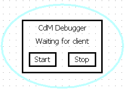

# Debugging in Logisim

Development kit provides support for debugging in Logosim with a plugin called `logisim-debugger`.

This allows users to debug their programs directly in Logisim with hardware they designed.

## Setting up debugger

To enable debugging you need to load a `logisim-debugger` plugin into Logisim.

- In `Logisim` go to `Project > Load Library > JAR Library` 
- Select `logisim-debugger-*.*.*.jar` that is located in `cdm-devkit-misc` archive in `jar` folder
- Now you have new category in Logisim's left menu that is called `CdM debugger`
- Place `Debugger` component from this category onto your root circuit
- Press `Start` button on the debugger component with `Poke` tool (<kbd>Ctrl</kbd>+<kbd>1</kbd>)
- Debugger should show status `Waiting for client`

> [!IMPORTANT]
> Both processor and debugger components should be located on the root circuit.

## Configuring VS Code

Set `environment` to `external` in your debug configuration in VS Code. 

Now you should be able to debug your program in Logisim.
